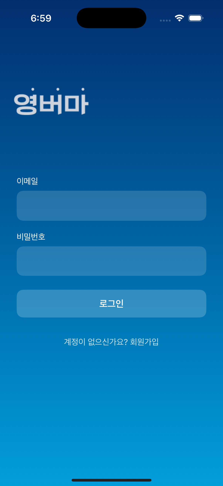
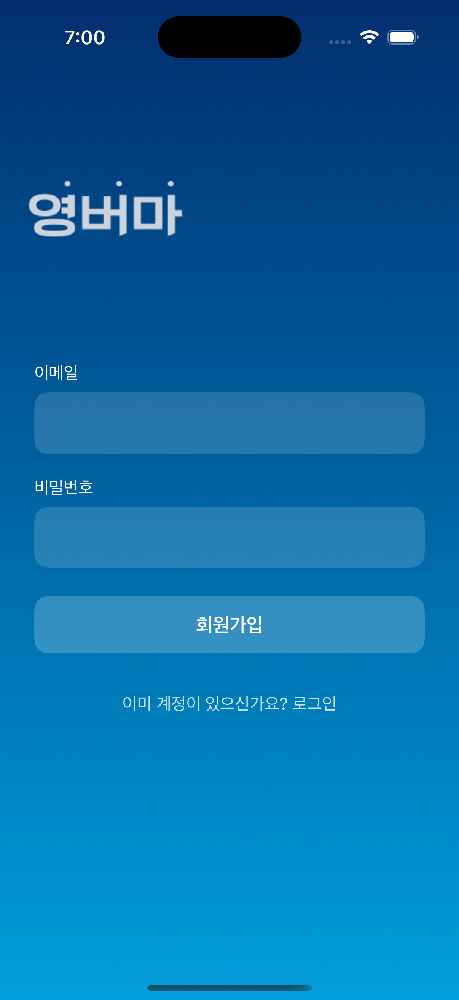
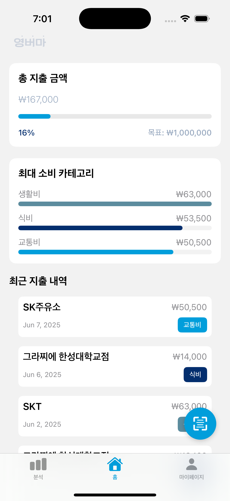
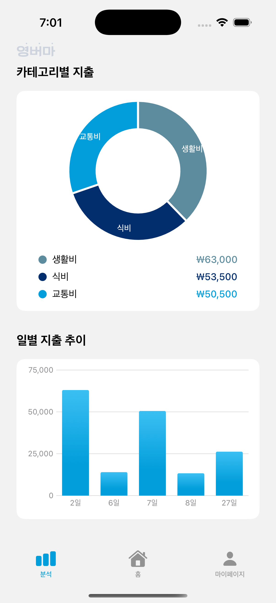
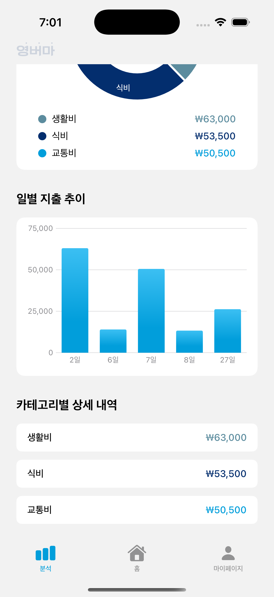
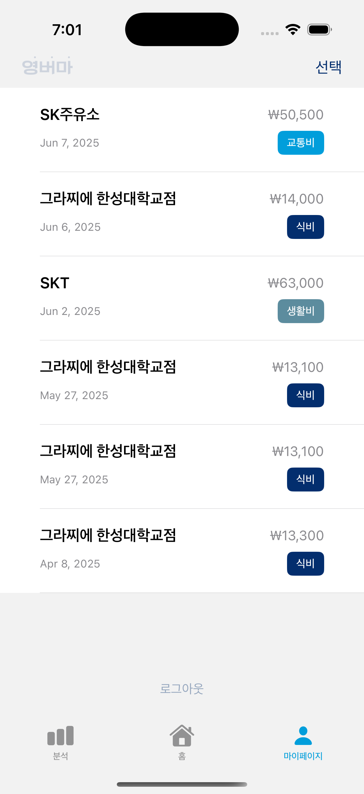
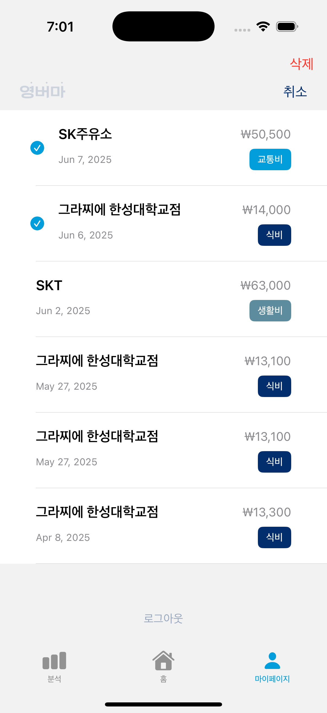
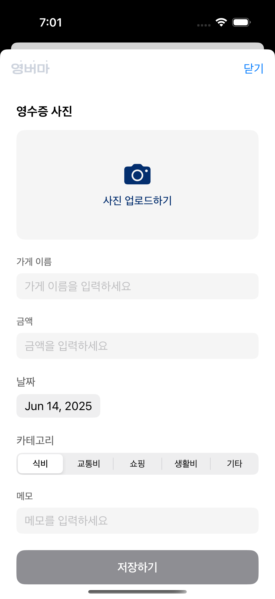
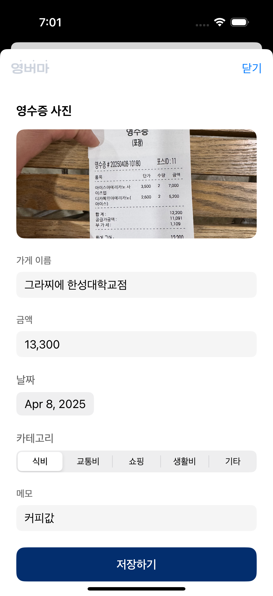

# KeepTheReceipt

<p align="center">
  
</p>

영수증을 디지털로 관리하고 지출을 분석할 수 있는 iOS 앱입니다.

---

## 📱 앱 사용 화면

<p align="center">
  
  
  
</p>

<p align="center">
  
  
  
</p>

<p align="center">
  
  
  
</p>

---

## 주요 기능

### 📄 영수증 등록 및 관리
- 영수증 이미지 업로드 / 직접 입력
- 가게명, 날짜, 금액, 카테고리 입력
- 영수증 목록 조회 및 삭제

### 📊 지출 분석
- 월별 총 지출 금액 확인
- 카테고리별 지출 분석
- 일별 지출 추이 확인

### 👤 사용자 관리
- 회원가입 및 로그인
- 마이페이지에서 지출 내역 관리

---

## 🛠 기술 스택

- **SwiftUI**
- **Firebase**
  - Authentication: 사용자 인증
  - Firestore: 데이터베이스
  - Storage: 이미지 저장

---

## 🚀 설치 및 실행

1. **Xcode 15.0 이상 설치**
2. **프로젝트 클론**
```bash
git clone https://github.com/CTOKKM/KeepTheReceipt.git
